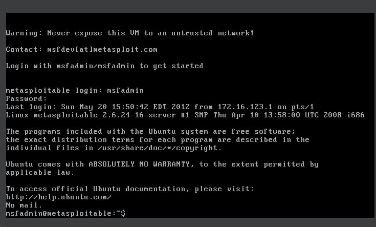
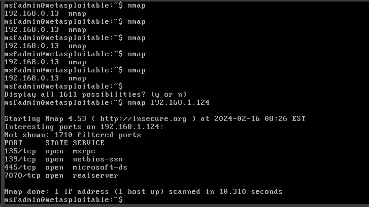
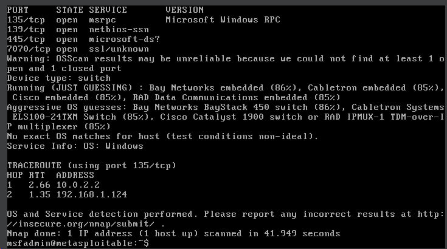
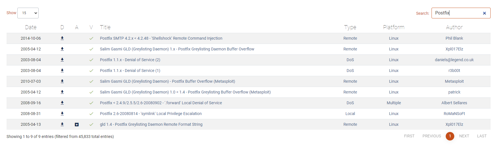
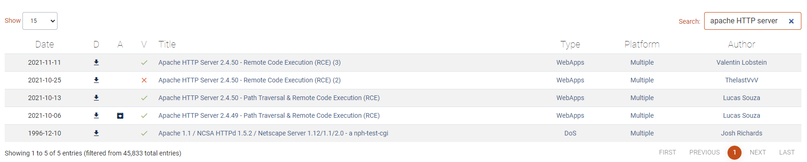

# Домашнее задание к занятию «Уязвимости и атаки на информационные системы» - Мильдзихов Сергей

### Задание 1

Скачайте и установите виртуальную машину Metasploitable: https://sourceforge.net/projects/metasploitable/.

Это типовая ОС для экспериментов в области информационной безопасности, с которой следует начать при анализе уязвимостей.

Просканируйте эту виртуальную машину, используя **nmap**.

Попробуйте найти уязвимости, которым подвержена эта виртуальная машина.

Сами уязвимости можно поискать на сайте https://www.exploit-db.com/.

Для этого нужно в поиске ввести название сетевой службы, обнаруженной на атакуемой машине, и выбрать подходящие по версии уязвимости.

Ответьте на следующие вопросы:

- Какие сетевые службы в ней разрешены?
- Какие уязвимости были вами обнаружены? (список со ссылками: достаточно трёх уязвимостей)
  

### Ответ

Был установлен Metasploitable
Стандартные логин и пароль

Логин по умолчанию: msfadmin
Пароль по умолчанию: msfadmin

- Какие сетевые службы в ней разрешены?

Разрешены следующие сетевые службы:

1. Apache HTTP Server
2. ProFTPD
3. Samba
4. MySQL
5. Postfix
6. OpenSSH

Эти службы были намеренно настроены с уязвимостями для тестирования эксплойтов и различных методов атаки. 

- Какие уязвимости были вами обнаружены? (список со ссылками: достаточно трёх уязвимостей)
Были найдены такие уязвимости, как:
	Apache HTTP Server 2.4.50 - Remote Code Execution (RCE)
  VSFTPD
  Postfix
  
  
  
  
### Задание 2

Проведите сканирование Metasploitable в режимах SYN, FIN, Xmas, UDP.

Запишите сеансы сканирования в Wireshark.

Ответьте на следующие вопросы:

- Чем отличаются эти режимы сканирования с точки зрения сетевого трафика?
- Как отвечает сервер?

### Ответ

#### Режим SYN
В этом режиме nmap отправляет пакеты SYN на целевой хост и анализирует ответы для определения открытых и закрытых портов.

#### Режим FIN
FIN-сканирование использует флаг TCP FIN (завершение соединения) для определения состояния портов на целевом хосте. 
Если порт закрыт, то целевой хост должен отправить ответ RST (сброс соединения). 
Если порт открыт, то целевой хост должен проигнорировать пакет FIN.

#### Режим XMAS
XMAS похож на FIN, но имеет свои особенности.
XMAS-сканирование использует комбинацию флагов TCP FIN, URG и PSH для определения состояния портов на целевом хосте. 
Если порт закрыт, то  хост должен отправить ответ RST.
Если порт открыт, то целевой хост должен проигнорировать XMAS.

#### Режим UDP (-sU)

Протокол UDP (User Datagram Protocol) является протоколом транспортного уровня, который обеспечивает передачу данных без установления соединения. 
При сканировании портов по протоколу UDP, nmap отправляет UDP-пакеты на целевой порт и ожидает ответа.
Если порт открыт и слушает UDP-трафик, то целевой хост должен отправить ответ. 
Если порт закрыт, то целевой хост должен отправить ICMP-сообщение о недоступности порта или проигнорировать пакет.

